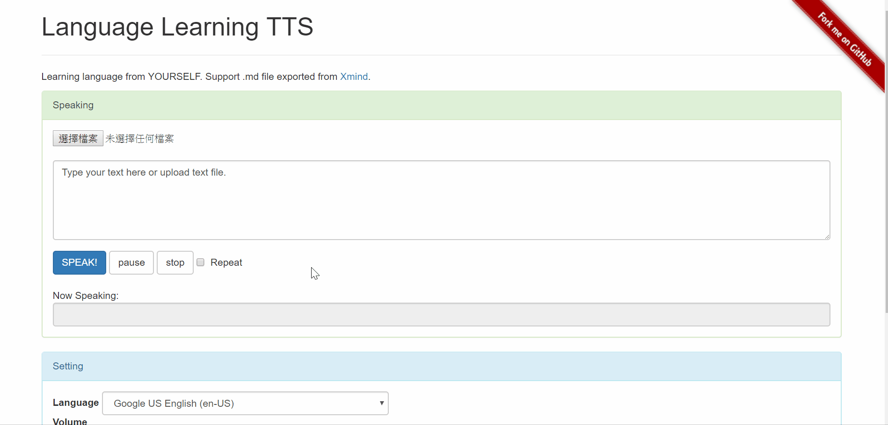
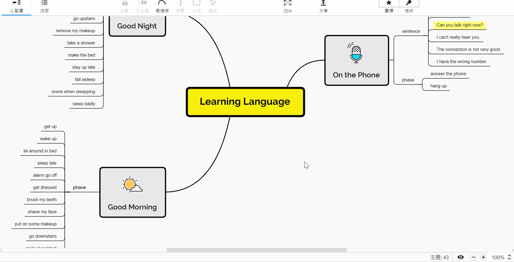

# Learning Language from TTS
> A speech synthesis for practicing listening. 
> (support .md exported from [Xmind](https://www.xmind.net/))

[![Build Status][travis-image]][travis-url]

## How to Use
[Live Demo](https://rollingseal.com/demo/language_learning_TTS/index.html)

1. Type some text or upload a .txt/.md file
2. Choose a language
3. SPEAK!

## Speech Source
1. Type text directly. (Multi-line supported)
2. Upload .txt file.
3. Upload .md file exported from [Xmind](https://www.xmind.net/).

## How to Export Xmind into .md

## Meta

Yichin Chiu – [website](https://rollingseal.com) – chiubeta@gmail.com

MIT license

## Contributing

1. Fork it (<https://github.com/chiubeta/language_learning_TTS/fork>)
2. Create your feature branch (`git checkout -b feature/fooBar`)
3. Commit your changes (`git commit -am 'Add some fooBar'`)
4. Push to the branch (`git push origin feature/fooBar`)
5. Create a new Pull Request
    
<!-- Markdown link & img dfn's -->
[travis-image]: https://img.shields.io/travis/dbader/node-datadog-metrics/master.svg?style=flat-square
[travis-url]: https://travis-ci.org/dbader/node-datadog-metrics